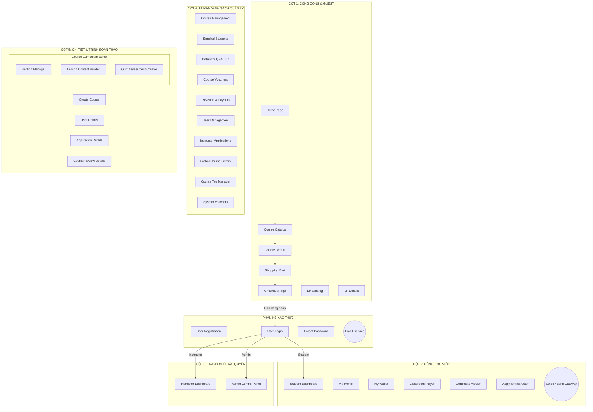

# Giải Thích Chi Tiết Sơ Đồ Luồng Giao Diện (Screen Flow Diagram) - Hệ Thống My Learning Path

Tài liệu này cung cấp lời giải thích chi tiết về sơ đồ luồng giao diện (**Screen Flow Diagram**) của hệ thống **My Learning Path**. Sơ đồ này mô tả cách các màn hình (UI Screens) tương tác, điều hướng và chuyển đổi trạng thái dựa trên các hành động của người dùng cũng như sự kiểm soát phân quyền của hệ thống.

---

## I. Quy Ước Ký Hiệu Trong Sơ Đồ

Để hiểu rõ các thành phần trên sơ đồ [screen_flow_diagram.drawio](file:///c:/Users/Administrator/Downloads/project-6-learning-path/screen_flow_diagram.drawio), hệ thống sử dụng các quy chuẩn trực quan sau:

*   **Hình chữ nhật viền đen (Rectangle)**: Đại diện cho một trang giao diện người dùng (UI Page/Screen) độc lập (các file template Thymeleaf `.html` trong mã nguồn).
*   **Hình Ellipse (Ellipse)**: Đại diện cho các tác nhân hoặc dịch vụ bên thứ ba nằm ngoài quyền kiểm soát giao diện trực tiếp của hệ thống (External Process / Gateway).
*   **Hộp chứa lớn (Swimlane)**: Nhóm các giao diện biên tập hoặc các màn hình con có mối quan hệ phụ thuộc chặt chẽ (ví dụ: trình biên tập bài học, chương mục của khóa học).
*   **Đường mũi tên một chiều (Arrow)**: Biểu thị luồng điều hướng của người dùng khi thực hiện một hành động (Click link, submit form, redirect...).
*   **Đường mũi tên có nhãn (Labeled Arrow)**: Biểu thị điều hướng có điều kiện hoặc có phân quyền (ví dụ: điều hướng sau khi đăng nhập thành công dựa trên vai trò).

---

## II. Phân Bố Bố Trí Hệ Thống (5 Cột Logic)

Sơ đồ được tổ chức thành **5 cột dọc** từ trái qua phải, phân nhóm theo vòng đời trải nghiệm người dùng và vai trò bảo mật:



### Chi tiết vai trò từng cột:

| Cột | Tên Phân Nhóm | Vai Trò & Đối Tượng Sử Dụng | Màn Hình Thành Phần |
| :--- | :--- | :--- | :--- |
| **Cột 1** | **Public & Guest Screens** | Dành cho người dùng chưa đăng nhập (Khách vãng lai) để khám phá, tìm hiểu thông tin và bắt đầu quy trình mua sắm khóa học. | `Home_Page`, `Course_Catalog`, `Course_Details`, `Cart_Page`, `Checkout_Page`, `Learning_Path_List`, `Learning_Path_Details`. |
| **Giữa C1 & C2** | **Authentication Screens** | Cổng xác thực và quản lý tài khoản chung cho mọi đối tượng người dùng. | `Register_Page`, `Login_Page`, `Forgot_Password`, `Email_Service` (Dịch vụ gửi OTP). |
| **Cột 2** | **Student Portal** | Không gian dành riêng cho Học viên (`ROLE_STUDENT`) để quản lý khóa học đã mua, học tập, nạp tiền ví và nhận chứng chỉ. | `Student_Dashboard`, `My_Profile`, `My_Wallet`, `Stripe_Gateway` (Cổng thanh toán ngoại), `Classroom_Player`, `Certificate_Viewer`, `Become_Instructor`. |
| **Cột 3** | **Authorized Dashboards** | Màn hình cổng vào (Trang chủ hành chính) cho Giảng viên (`ROLE_INSTRUCTOR`) và Quản trị viên (`ROLE_ADMIN`). | `Instructor_Dashboard`, `Admin_Dashboard`. |
| **Cột 4** | **Management Lists** | Danh sách quản lý nghiệp vụ chuyên sâu. Tách biệt thành 5 phân hệ của Giảng viên và 5 phân hệ của Admin. | **Giảng viên**: `Inst_Course_List`, `Inst_Student_List`, `Inst_QnA_Manager`, `Inst_Voucher_Manager`, `Revenue_Dashboard`. <br>**Admin**: `Admin_User_Manager`, `Admin_App_Manager`, `Admin_Course_Manager`, `Admin_Tag_Manager`, `Admin_Voucher_Manager`. |
| **Cột 5** | **Details & Editors** | Các giao diện nhập liệu chi tiết, chỉnh sửa chuyên sâu và cấu trúc lồng nhau phức tạp. | `Create_Course`, `Course_Editor` (chứa `Section_Builder`, `Lesson_Builder`, `Quiz_Builder`), `User_Details`, `Application_Details`, `Admin_Course_Details`. |

---

## III. Phân Tích Các Luồng Nghiệp Vụ Chi Tiết (Key Flows)

### 1. Luồng Khám Phá & Mua Sắm Khóa Học (Guest / Student Purchase Flow)
*   **Trình tự di chuyển**:
    $$Home\_Page \rightarrow Course\_Catalog \rightarrow Course\_Details \rightarrow Cart\_Page \rightarrow Checkout\_Page$$
*   **Lộ trình học tập**: Học viên cũng có thể đi từ:
    $$Home\_Page \rightarrow Learning\_Path\_List \rightarrow Learning\_Path\_Details \rightarrow Course\_Details$$
*   **Logic Ràng Buộc**:
    *   Tại `Checkout_Page`, nếu học viên nhấn "Thanh toán" nhưng chưa đăng nhập hệ thống, hệ thống sẽ thực hiện điều hướng bắt buộc sang `Login_Page`.
    *   Sau khi đăng nhập thành công, học viên sẽ được đưa trở lại `Checkout_Page` (hoặc chuyển sang `Student_Dashboard` tùy theo cấu hình session).

### 2. Luồng Xác Thực & Định Tuyến Vai Trò (Authentication & Authorization Routing)
*   **Đăng ký & Đăng nhập**: `Login_Page` liên kết chéo với `Register_Page` để người dùng linh hoạt tạo tài khoản hoặc đăng nhập trực tiếp.
*   **Khôi phục mật khẩu**:
    $$Login\_Page \rightarrow Forgot\_Password \rightarrow Email\_Service (OTP) \rightarrow Login\_Page$$
*   **Định tuyến sau Đăng nhập**: `Login_Page` đóng vai trò là bộ lọc phân quyền. Dựa vào phân quyền Spring Security (`Authentication` chứa Role):
    *   Nếu là **Student**: Chuyển hướng sang `Student_Dashboard`.
    *   Nếu là **Instructor**: Chuyển hướng sang `Instructor_Dashboard`.
    *   Nếu là **Admin**: Chuyển hướng sang `Admin_Dashboard`.

### 3. Luồng Học Tập & Nhận Chứng Chỉ (Student Learning & Certification Flow)
*   **Bắt đầu học**: Từ `Student_Dashboard`, học viên click vào khóa học đã mua để vào giao diện học tập **`Classroom_Player`**.
*   **Tương tác trong lớp học**: Tại `Classroom_Player`, học viên học qua các bài giảng video/văn bản, làm bài trắc nghiệm, và gửi câu hỏi hỏi đáp (giao diện này liên kết ngầm với `Inst_QnA_Manager` ở phía giảng viên).
*   **Cấp chứng chỉ**: Sau khi học viên hoàn thành $100\%$ tiến độ học tập và vượt qua các bài kiểm tra bắt buộc:
    $$Classroom\_Player \rightarrow Certificate\_Viewer$$
*   Tại `Certificate_Viewer`, học viên có thể xem, tải chứng chỉ dạng PDF hoặc bấm vào nút ứng tuyển làm Giảng viên hệ thống (`Become_Instructor`).

### 4. Luồng Nghiệp Vụ Của Giảng Viên (Instructor Workspace Flow)
Từ `Instructor_Dashboard`, giảng viên quản lý các công việc của mình thông qua:
*   **Biên tập Chương trình học**:
    $$Inst\_Course\_List \rightarrow Create\_Course / Course\_Editor$$
    *   Trình soạn thảo khóa học `Course_Editor` là một phân hệ lồng nhau phức tạp chứa **Section Manager** (quản lý chương mục), **Lesson Content Builder** (soạn thảo bài học, tải video) và **Quiz Assessment Creator** (tạo bài trắc nghiệm).
*   **Quản lý Câu hỏi Học viên**: Giao diện `Inst_QnA_Manager` thu nhận tất cả câu hỏi được học viên gửi từ `Classroom_Player` để giảng viên phản hồi kịp thời.
*   **Khuyến mãi**: Giảng viên tạo mã giảm giá riêng tại `Inst_Voucher_Manager` để áp dụng riêng cho các khóa học của mình.
*   **Tài chính**: Theo dõi doanh thu thực nhận sau khi trừ chiết khấu hệ thống và gửi yêu cầu rút tiền về tài khoản ngân hàng thông qua `Revenue_Dashboard`.

### 5. Luồng Nghiệp Vụ Của Quản Trị Viên (Admin Control Flow)
Admin kiểm soát toàn bộ vòng đời của người dùng và nội dung trên hệ thống từ `Admin_Dashboard`:
*   **Quản lý người dùng**:
    $$Admin\_User\_Manager \rightarrow User\_Details$$
    Cho phép Admin xem thông tin chi tiết, khóa hoặc mở khóa tài khoản người dùng tại `User_Details`.
*   **Duyệt Giảng viên**:
    $$Admin\_App\_Manager \rightarrow Application\_Details$$
    Khi học viên nộp đơn làm giảng viên (`Become_Instructor`), đơn ứng tuyển sẽ xuất hiện tại `Admin_App_Manager`. Admin click xem chi tiết CV PDF và thông tin tại `Application_Details` để duyệt/từ chối đơn.
*   **Duyệt Khóa học**:
    $$Admin\_Course\_Manager \rightarrow Admin\_Course\_Details$$
    Mọi khóa học mới do giảng viên tạo hoặc cập nhật đều ở trạng thái chờ duyệt. Admin sẽ kiểm duyệt nội dung kỹ lưỡng tại `Admin_Course_Details` trước khi xuất bản chính thức lên `Course_Catalog`.

---

## IV. Cơ Chế Tài Chính & Ví Điện Tử (Wallet & Payment Integration)

Luồng giao dịch tài chính được thiết kế khép kín và an toàn thông qua sự kết hợp giữa hệ thống ví nội bộ và cổng thanh toán Stripe ngoài:

```
[Student Portal: My_Profile]
          │
          ▼
[Wallet Page: My_Wallet]  ◄───────────┐
          │ (Yêu cầu nạp tiền)        │ (Redirect kèm trạng thái)
          ▼                           │
   [Stripe_Gateway] ──────────────────┘
   (Xác thực thanh toán ngân hàng / thẻ tín dụng quốc tế)
```

1. Học viên vào `My_Profile` $\rightarrow$ chọn `My_Wallet` để kiểm tra số dư hiện tại.
2. Học viên nhập số tiền muốn nạp và nhấn "Nạp tiền". Hệ thống tạo mã giao dịch tạm thời và điều hướng học viên sang trang **`Stripe_Gateway`** (Cổng Stripe bên thứ ba).
3. Sau khi người dùng thực hiện thanh toán thành công/thất bại tại Stripe, Stripe sẽ tự động chuyển hướng người dùng quay trở lại trang **`My_Wallet`** của hệ thống kèm theo tham số trạng thái giao dịch để hệ thống xử lý cộng tiền vào ví và ghi nhận lịch sử giao dịch.
